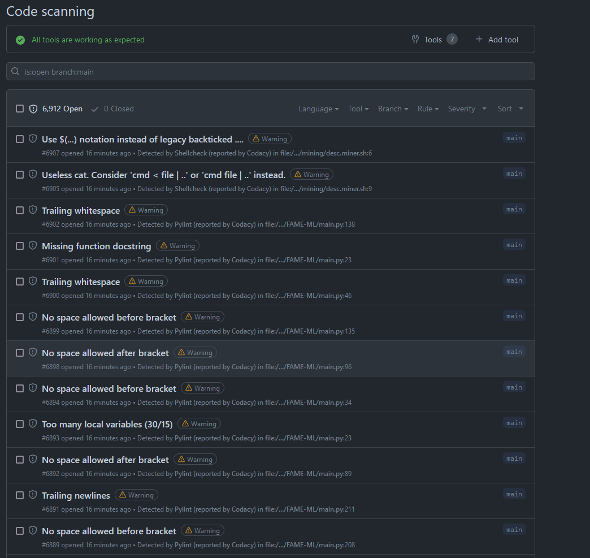

# Gucci Bucket Hat

- Cal Crosby

- Stephen Lee

## Requirements

- Python 3

## Description

This repository will use scripts to complete the SQA project. Scripts of note include:

- `setup.ps1` - A script that will install all necessary dependencies for the project.

- `bandit.ps1` - A script that sets up the bandit security tool for pre-commit hooks.

- `everything.ps1` - A script that does all of the above.

## Report

To begin, we took the `.zip` file, and unpacked it to this repo.

To ensure that we have a common environment, we created some `.ps1` scripts like the ones mentioned above.

A goal of this project is to ensure that everything is traceable through scripts.

### Bandit

One of the requirements is a pre-commit hook that will analyze the code for security. We opted to use Bandit.

One issue was that we couldn't make commits because the existing code has errors, but fixing these errors is outside the scope of the project.

Therefore, we needed to commit hook to only run on the files that we change.

### Codacy

We integrated Codacy into the project to ensure that the code is up to standard.

Doing this allows us to perform continuous integration - passing code is automatically merged into the main branch.

This keeps code quality high and ensures that the code is always in a working state, increasing the reliability of the project.

Integration Codacy found 5000 security issues, which means that we can increase the security of the project.

