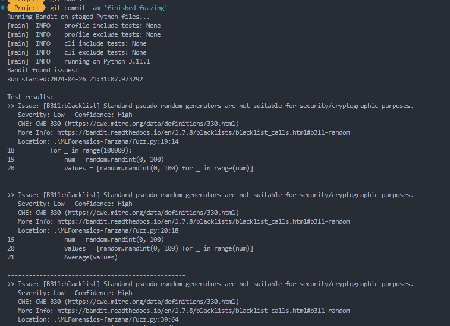
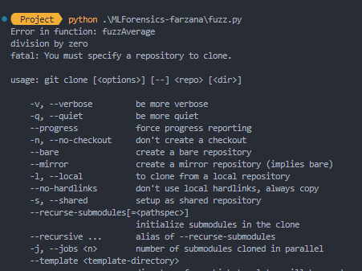

## Report

To begin, we took the `.zip` file, and unpacked it to this repo.

To ensure that we have a common environment, we created some `.ps1` scripts like the ones mentioned above.

A goal of this project is to ensure that everything is traceable through scripts.

### Bandit

One of the requirements is a pre-commit hook that will analyze the code for security. We opted to use Bandit.

One issue was that we couldn't make commits because the existing code has errors, but fixing these errors is outside the scope of the project.

Therefore, we needed to commit hook to only run on the files that we change.

### Fuzzing

We implemented fuzzing to ensure that the code is robust and can handle unexpected inputs.

The fuzzing is at [fuzz.py](./MLForensics-farzana/fuzz.py).

One bug that we found is that the `Average` method incorrectly divides by zero when the list is empty.

### Forensic

We integrated forensics to 5 different methods: getAllcommits, getDevEmails, days_between, getAllFileCount, and cloneRepo.

getAllcommits: The change made to this function will check for any suspecious commits made between hours 24 ~ 8. 

Implemented new list that holds all the suspecious commits and a for loop that tracks all commits made and add anything that is made between 24 ~ 8.

getDevEmails: The change made to this function will report any devs with low count of commits.

Specifically set to lower than 3.

cloneRepo: The change will check ensure the repo starts with https://github.com. 

This will avoid any other repo to be cloned.

dat_between: The change will confirm both inputs are in datetime object.

getAllFileCount: This will simply verify all files exist.

### Codacy

We integrated Codacy into the project to ensure that the code is up to standard.

Doing this allows us to perform continuous integration - passing code is automatically merged into the main branch.

This keeps code quality high and ensures that the code is always in a working state, increasing the reliability of the project.

Integration Codacy found 5000 security issues, which means that we can increase the security of the project.

